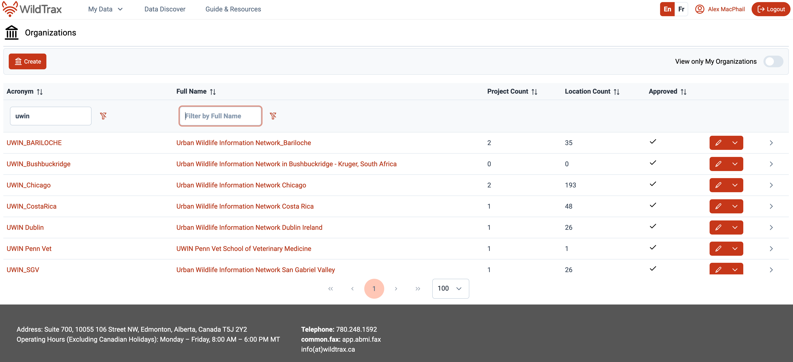

**Duration:** 2 hours  
**Goal:** Build a shared understanding of how data science and technology can better support collaborative research, identify barriers and opportunities, and create actionable next steps.

By the end of the session, participants will:

- Have a shared understanding of the data lifecycle.  
- Identify top barriers and opportunities for collaboration.  
- Feel equipped with knowledge to move forward and reduce fear around technology adoption.

## Agenda

- **20 mins** – Welcome, framing the session, and overview of the research data lifecycle  
- **25 mins** – Individual worksheet activity: Identifying pinch points  
- **15 mins** – A success story in Edmonton  
- **50 mins** – Group discussion: Building a shared vision for collaboration  
- **10 mins** – Wrap-up and closing notes

::: {.callout-note collapse="true" style="background-color: #f4f4f4; padding: 20px;"}
- We intend to objectively meet people where they are, and focus-in on where the **pinch points** are in their workflows.  
- Use **Mentimeter** for anonymous input and to gather diverse perspectives.  
- Using **home groups** to synthesize ideas and bring them back together.  
- Refine Mentimeter polls to ensure questions are clear and responses are actionable.  
- Identify missing elements:
  - Data sharing practices
  - Discuss future UWIN needs
:::

## Workshop Sections

### 1. Welcome and Framing the Session (10 mins)

**Presenter:** Alex MacPhail    **Purpose:** Introduce [WildTrax](https://www.widltrax.ca) and contextualize it within big data and ecological research.

**Content:**

- Introductions (WildTrax team)
- Importance of data science and technology in ecological research
- Showcase WildTrax and its diverse network of partners
- Workshop goals:
  - Bridge field ecology and big data with software  
  - Identify current limitations and opportunities  
  - Define next steps for collective data sharing and integration using WildTrax  

::: {.callout-note collapse="true" style="background-color: #f4f4f4; padding: 20px;"}
## 💡 Mentimeter Icebreaker

In **one word**, what’s your biggest challenge with data right now?

Jump in and share — no wrong answers, and your response is completely anonymous!
:::

### 2. The Research Data Lifecycle (10 mins)

**Presenters:** Mason Fidino and Alex MacPhail  
**Purpose:** Establish a shared understanding of the ecological data lifecycle and common language and framing this with the **UWIN** framework.

**Lifecycle Stages:**

1. Data collection (fieldwork)  
2. Data management and quality control  
3. Processing and validation  
4. Analysis and reporting  
5. Publishing and sharing  
6. Integration and scaling across projects and networks

### 3. Identifying Pinch Points (25 mins)

**Presenter:** Dianne Russell  
**Goal:**  Identify barriers in the research data lifecycle and explore potential solutions.

**Activity:**  
Participants complete a worksheet to:

1. Identify key pinch points in their work.
2. Explore why these pinch points exist.
3. Note what has been tried to address them.
4. Share anecdotes or real-world examples.

**Worksheet Questions:**

1. What are the biggest challenges you face in the data lifecycle? (List 2–3)  
2. What barriers or limitations caused these challenges?  
3. What tools or services could UWIN/WildTrax provide to help?  
4. If these challenges were resolved, what projects would you be excited to pursue?

### 4. A Success Story with the City of Edmonton (15 mins)

**Presenter:** Catherine Shier, City of Edmonton  
**Goal:** Showcase how long-term monitoring programs can evolve through improved data management and integration.

**Story Focus:**

- Transition from siloed, standalone systems to connected, living datasets.
- Timely data products generated within the same season of collection.
- Improved collaboration through shared, accessible data resources.

**Key Message:**
WildTrax enables organizations to transform legacy datasets into valuable, connected resources that drive collaboration and innovation.

### 5. Building a Shared Vision for Collaboration (50 mins)

**Presenters:** UWIN / ICL / WildTrax  
**Goal:**
Explore how cities and organizations can leverage WildTrax to:
- Scale ecological research
- Share data, tools, and infrastructure
- Identify actionable next steps

**Home Group Discussions:**

1. Share your **top 2 challenges** from the worksheet and scribe them on a flip chart.  
2. As a group:
   - Identify **3–4 challenge themes** by connecting related challenges.  
   - On separate chart pages, outline action steps for a UWIN research project lifecycle:
     - **30 days**
     - **90 days**
     - **1 year**
     - **3 years**
3. Map where challenge themes intersect with the roadmap timelines.

### 6. Wrap-up and Closing Notes (10 mins)

**Summary:**

- Highlight key takeaways:
  - Barriers identified (via home group report-outs)
  - Proposed solutions
  - Agreed-upon priorities and pilot projects
- Clarify next steps and accountability:
  - Assign leads or working groups
- Share resources:
  - WildTrax guides and documentation
  - Data management templates
  - Communication channels for ongoing collaboration
